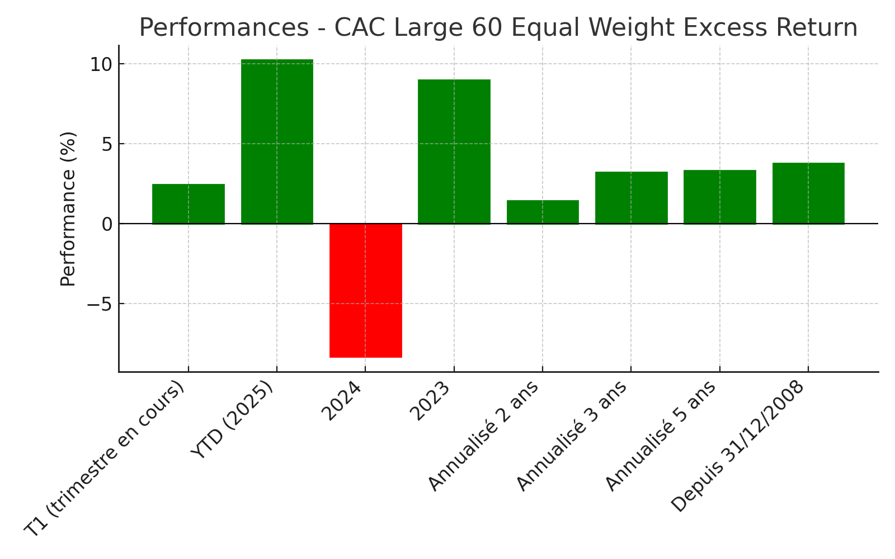

# Indice CAC Large 60 Equal Weight Excess Return

## Définition
L’**indice CAC Large 60 Equal Weight Excess Return** (code Bloomberg : CLEWE) est composé des 60 plus grandes valeurs cotées à Paris (CAC 40 + CAC Next 20), **pondérées de manière égale**.
Il intègre les dividendes nets et applique une **décote fixe de 5 %/an** (calculée quotidiennement).

- **Lancé** : 24 avril 2015  
- **Base** : 1 000 points au 31 décembre 2008  
- **Méthodologie** : équipondéré, Total Return, moins 5 % p.a.

## Cotation récente
- **Valeur au 11 août 2025** : **1 803,25 points**
- **Variation du jour** : +0,59 %

## Performances
| Période                  | Performance (%) |
|--------------------------|-----------------|
| T1 (trimestre en cours)  | 2.43            |
| YTD (2025)               | 10.22           |
| 2024                     | -8.30           |
| 2023                     | 8.96            |
| Annualisé 2 ans          | 1.43            |
| Annualisé 3 ans          | 3.20            |
| Annualisé 5 ans          | 3.32            |
| Depuis 31/12/2008        | 3.78            |

## Graphique des performances

